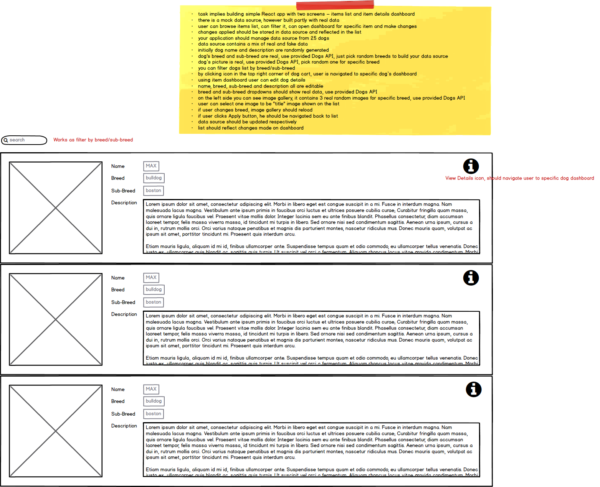
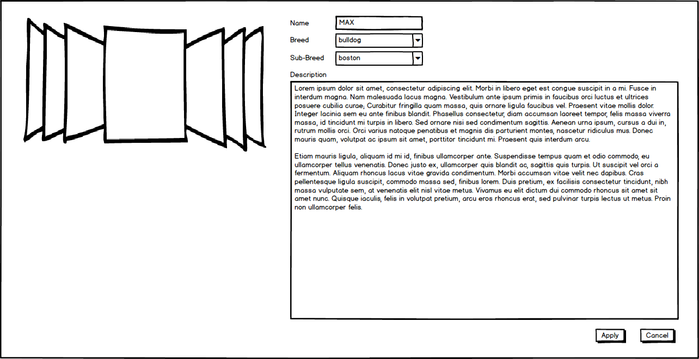

# React.js Technical Test Project

Please fork this repository into your private Github account to develop your solution.

## Summary

- Task implies building a simple React app with two screens: an **items list** and an **item details** dashboard.
- There is a mock data source, however it is built partly with real data.
- The user can browse items list, can filter it, can open dashboard for specific item and can make changes to an item.
- Changes applied should be stored in data source and reflected in the list.
- Your application should manage data source from 25 dogs.
- Data source contains a mix of real and fake data.
- Initially dog name and description are randomly generated.
- Dog's breed and sub-breed are real, use provided Dogs API, just pick random breeds to build your data source.
- Dog’s picture is real, use provided Dogs API, pick random one for specific breed.
- You can filter dogs list by breed/sub-breed.
- By clicking icon in the top right corner of dog cart, user is navigated to specific dog’s dashboard.
- Using item dashboard user can edit dog details.
- Name, breed, sub-breed and description all are editable.
- Breed and sub-breed dropdowns should show real data, use provided Dogs API.
- On the left side you can see image gallery, it contains 3 real random images for specific breed, use provided Dogs API.
- User can select one image to be "title" image shown on the list.
- If user changes breed, image gallery should reload.
- If user clicks Apply button, he should be navigated back to list.
- Data source should be updated respectively.
- List should reflect changes made on dashboard.

**Public REST API endpoints** - https://dog.ceo/dog-api/documentation/

## Solution Requirements

- Solution is supposed to be quite simple.
- No specific requirements for assets, styling or third party libraries.
- However, keep provided mockups idea and pattern.
- Please, try to implement all described items.
- You have up to 48 hours to implement solution and demonstrate.
- Start solution from scratch, use React boilerplate of your choice.
- Code should be runnable and executable.
- Solution should use Functional Components, Hooks and etc.
- Be ready to demonstrate application in action and explain code and approaches used in detail.

## Mockups

